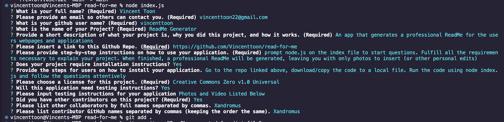
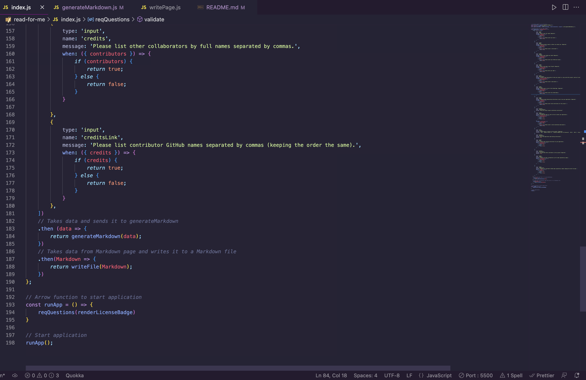
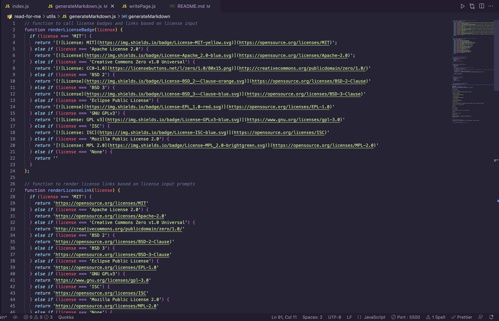
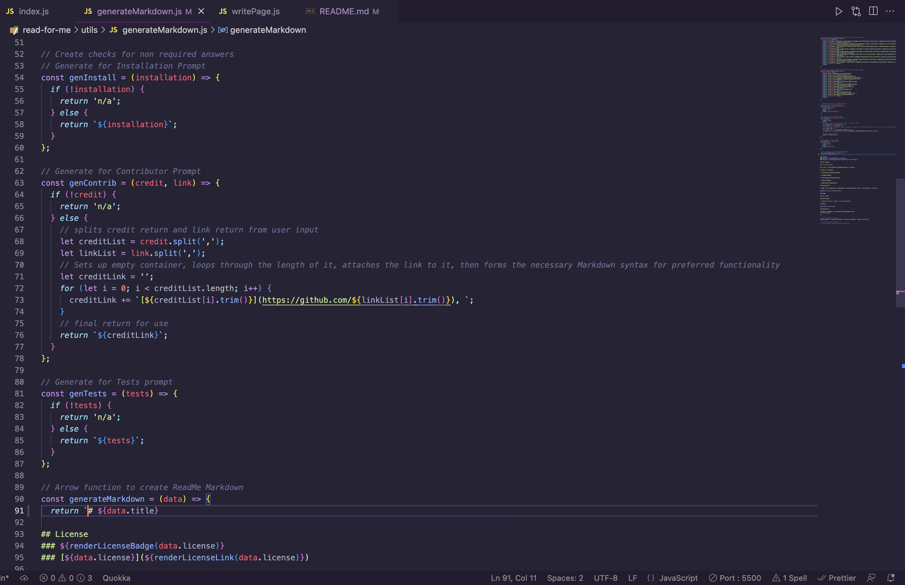
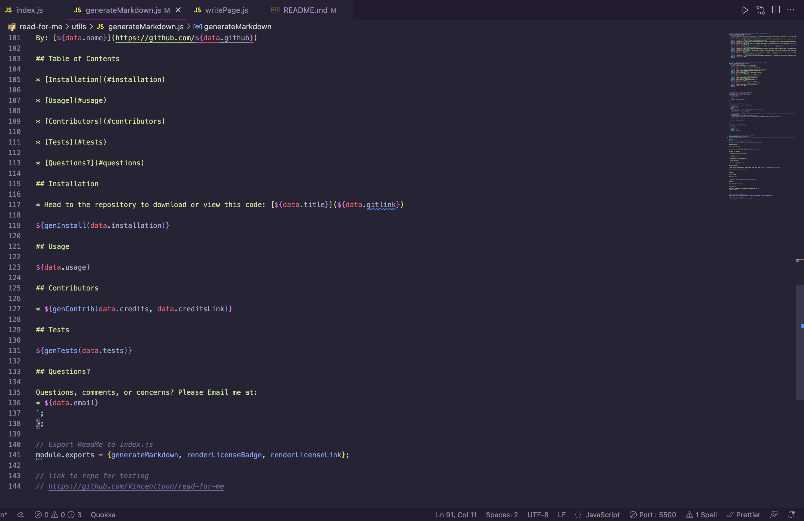
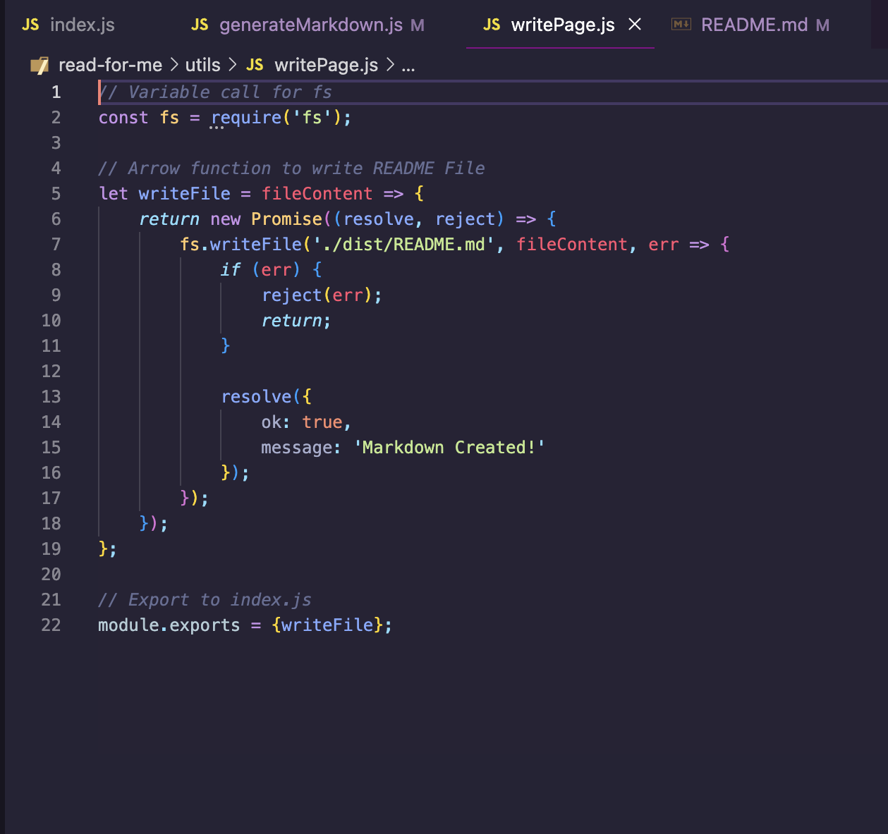

# ReadMe Generator

## License
### 
### [Creative Commons Zero v1.0 Universal](http://creativecommons.org/publicdomain/zero/1.0/)

## Description

An app that generates a professional ReadMe for the users webpages and applications

By: [Vincent Toon](https://github.com/vincenttoon)

## Table of Contents

* [Installation](#installation)

* [Tests](#tests)

* [Usage](#usage)  

* [Contributors](#contributors)

* [Questions?](#questions)

## Installation

* Head to the repository to download or view this code: [ReadMe Generator](https://github.com/Vincenttoon/read-for-me)

1. Go to the repo linked above 
2. Download/copy the code to a local file. 
3. Run the code using node index.js 
4. Follow the questions attentively

## Tests

[Video Demonstration](...) 

## Usage

* Prompt node.js on the index file to start questions. Fulfill all the requirements necessary to explain your project. 

* When finished, a professional ReadMe will be generated, leaving you with only photos to insert (or other personal edits) 

* The Index.js file in home for the other JS files to direct/receive their information. This file includes the question array of prompts for the user and calls the function.  

* The generateMarkdown.js File sets up all the parameters necessary for the badge checks   and user input options  

* Then dynamically generates the Markdown with the information received from the index prompts through literal manipulation 

* The writePage.js file writes the information taken from index.js and the checks/formatting from generateMarkdown.js and writes a file to make it visible to the user. 

## Contributors

* Starter code repository (given to me through WashU Fullstack Bootcamp) [Xandromus](https://github.com/Xandromus)

### Future Improvements

* Dynamically create photo links as prompts for the user
* Dynamically create video links for testing section
* Add second prompt for user to with more features

## Questions?

Questions, comments, or concerns? Please Email me at:
* vincenttoon22@gmail.com